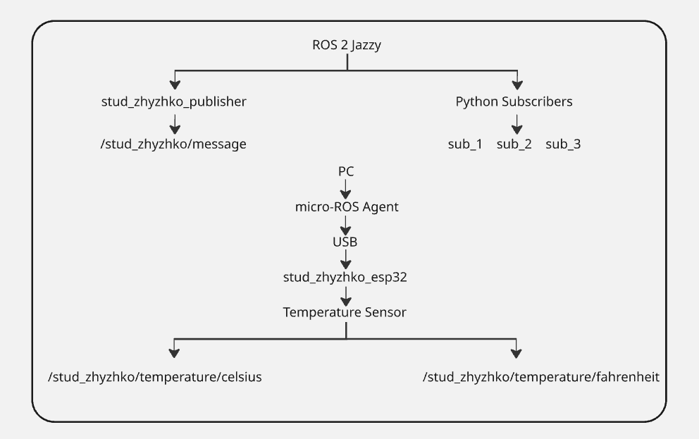
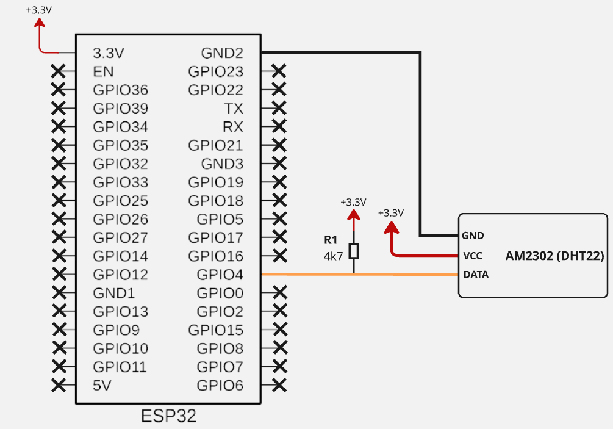
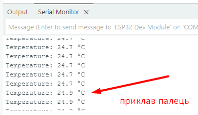
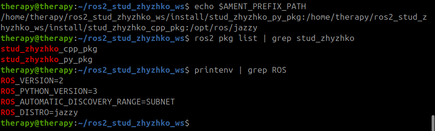
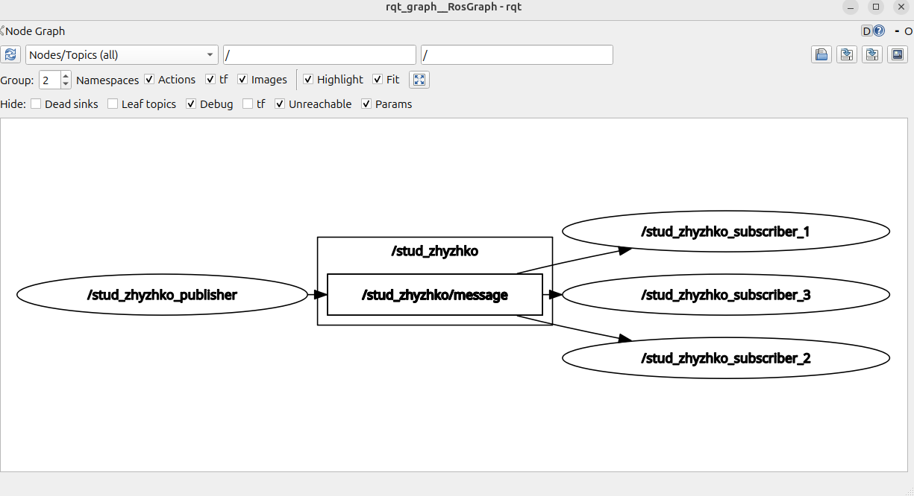
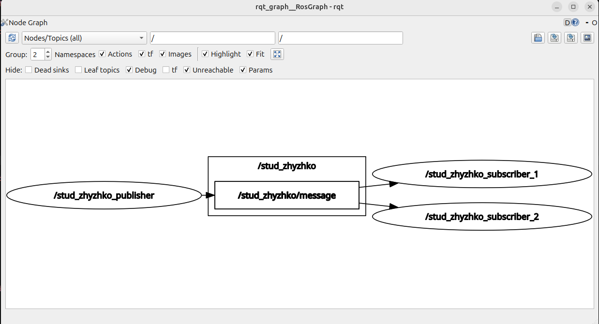
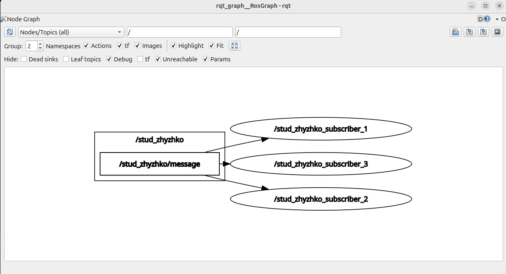
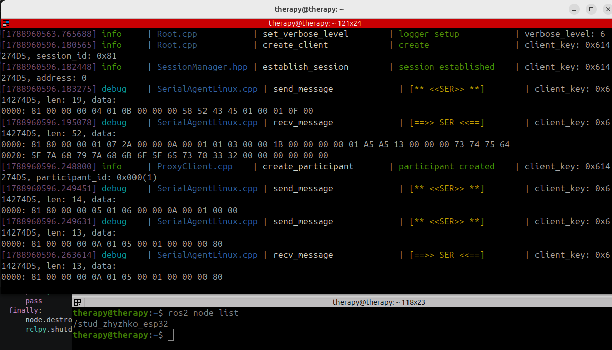
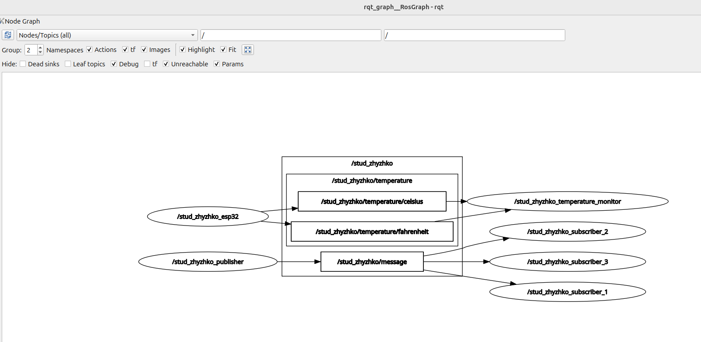

# Самостійна робота 1

Жижко Олексій, РТ-3

## Схема системи


## Опис пакетів
**`stud_zhyzhko_cpp_pkg`** - C++ пакет, що містить вузол паблішер текстових повідомлень
**`stud_zhyzhko_py_pkg`** - Python пакет, що містить вузли сабскрайберів та монітор температури
**`esp32_firmware`** - прошивка для  ESP32, яка зчитує дані з датчика DHT22 і передає їх у ROS 2 через micro-ROS

## Таблиця класів
| Клас | Батьківський | Поля | Методи |
| :--- | :--- | :--- | :--- |
| `StudentPublisher` | `rclcpp::Node` | `publisher_`, `timer_`, `counter_` | `timer_callback()` |
| `StudentSubscriber` | `Node` | `subscription` | `listener_callback()` |
| `TemperatureMonitor` | `Node` | `sub_celsius`, `sub_fahrenheit`, `last_celsius`, `last_fahrenheit` | `celsius_callback()`, `fahrenheit_callback()`, `print_temperature()` |

## Списки Nodes і Topics
**Nodes:**
* `/stud_zhyzhko_publisher`
* `/stud_zhyzhko_subscriber_1`
* `/stud_zhyzhko_subscriber_2`
* `/stud_zhyzhko_subscriber_3`
* `/stud_zhyzhko_esp32`
* `/stud_zhyzhko_temperature_monitor`

**Topics:**
* `/stud_zhyzhko/message`
* `/stud_zhyzhko/temperature/celsius`
* `/stud_zhyzhko/temperature/fahrenheit`

## Команди збірки та запуску

Збірка воркспейсу:

```bash
colcon build
source install/setup.bash
```

Запуск micro-ROS Agent (через Docker):

```bash
sudo docker run -it --rm --privileged -v /dev:/dev --net=host microros/micro-ros-agent:jazzy serial --dev /dev/ttyUSB0 -b 115200 -v6
```

## Опис датчика та підключення
| Параметр            | Значення                                |
| :------------------ | :--------------------------------------- |
| Модель              | AM2302 (DHT22)                          |
| Живлення            | 3.3V                                    |
| Інтерфейс           | цифровий                                |
| Діапазон            | -40 - +80 °C                            |
| Точність            | +- 0.5 °C                               |
| Роздільна здатність | 0.1 °C                                  |
| Підключення         | VCC до 3.3V, GND до GND, DATA до GPIO 4 |






## Експерименти та відповіді на питання


### Власний workspace (етап 1)



Каталоги workspace:

| Каталог    | Призначення                                                                                            |
| :--------- | :----------------------------------------------------------------------------------------------------- |
| `src/`     | вихідний код: усі пакети (packages) зі своїми `CMakeLists.txt` / `package.xml`, `.cpp` / `.py` файлами |
| `build/`   | проміжні файли збірки, які генерує `colcon build`; вручну не редагуються і в git не потрапляють        |
| `install/` | результат збірки - виконувані файли, бібліотеки та `setup.bash`, саме звідси підключається workspace   |
| `log/`     | логи процесу збірки для кожного пакета - зручно для діагностики помилок `colcon build`                 |

Чому `install/setup.bash` власного workspace підключається після `/opt/ros/jazzy/setup.bash`, а не замість нього. 

Власний workspace є overlay поверх базової інсталяції ROS 2 (underlay), а не її заміною. Базова інсталяція надає ядро ROS 2 - `rclcpp`, `rclpy`, `std_msgs` та інші пакети, від яких залежать власні пакети. Якщо підключити тільки `install/setup.bash` свого workspace, ці базові залежності просто не будуть знайдені. Тому overlay підключається другим і лише додає шляхи до своїх пакетів у `AMENT_PREFIX_PATH`, не видаляючи те, що вже підключив underlay.


### Дослідження системи через ROS 2 CLI (етап 5)

.png)
.png)
.png)


### Три Subscribers (етап 6)

1) Чому одне повідомлення від publisher доходить до всіх трьох nodes і скільки разів воно при цьому фактично публікується ?

Одне повідомлення доходить до всіх трьох підписників, так як в ROS 2 використовується архітектура на базі DDS, де ці вузли спілкуються не безпосередньо, а типу як підписуються на спільну  шину даних, тобто topic. Паблішер формує та публікує повідомлення в мережу  один раз, взагалі не знаючи про кількість активних слухачів. Ну і далі вже саме проміжне програмне забезпечення (middleware DDS) бере на себе задачу маршрутизації та доставлення цього пакету даних кожному субскрайберу окремо.

2) У якій ситуації тут довелося б використати service (запит–відповідь) замість topic ?

Сервіс довелося б використати замість топіка в ситуації, коли вузлу потрібно надіслати конкретну команду або запит і дочекатися підтвердження її виконання або повернення зворотного результату (наприклад, команда на зміну налаштувань датчика).


### rqt_graph (етап 7)





1) Крок 1. Зупинка subscriber_3:

З графа зник node (вузол `stud_zhyzhko_subscriber_3`) та  стрілка, яка вела до нього від топіка `/stud_zhyzhko/message`. Сам топік і решта графа залишилися без змін, оскільки паблішер продовжує публікувати дані, а інші два підписники їх читати.

2) Крок 3. Зупинка publisher:

З графа зник node (вузол `stud_zhyzhko_publisher`) та стрілка, що вела від нього до топіка. Cам топік `/stud_zhyzhko/message` з графа не зник, він залишився, але тепер до нього не веде жодної вхідної стрілки, є лише вихідні (до підписників).


**Чому результат різний (пояснення для звіту):**

Результат різний, тому що він  демонструє принцип слабкої зв'язності у ROS 2. Топік не є власністю паблішера чи сабскрайбера, це незалежна шина даних. У першому випадку ми прибрали одного з отримувачів, а в другому єдине джерело даних. В обох випадках сам топік продовжує існувати в системі (і на графі) доти, доки є хоча б один активний вузол, який задекларував намір з ним взаємодіяти. Підписники можуть успішно існувати й очікувати на дані навіть тоді, коли джерела цих даних фізично немає в мережі.


Нижче скріншоти етапів:


**Зупинка subscriber_3:**  **Зупинка publisher:** 


### Інтеграція ESP32 через micro-ROS (етап 9)

Команда запуску Agent та її вивід у момент підключення плати:



**Яку роль виконує micro-ROS Agent і чому без нього ESP32 не з'являється в графі:**

micro-ROS Agent виступає мостом між мікроконтролером, який фізично не має ресурсів для повноцінного DDS-стека, і великим ROS 2 на комп'ютері. ESP32 через клієнтську бібліотеку rclc спілкується з Agent по легкому протоколу Micro XRCE-DDS (у нашому випадку через USB), а вже сам Agent виступає повноцінним DDS учасником від імені мікроконтролера. Без запущеного Agent повідомлення від ESP32 просто нікуди не потрапляють, плата не вміє самостійно бути звичайним DDS вузлом, тому вона не видима іншим nodes і не з'являється на rqt_graph.

**Чому на мікроконтролері використовується rclc, а не rclcpp:**

`rclcpp`  це C++ клієнтська бібліотека, вимагає ресурсів, яких у ESP32 немає. `rclc` легка C-бібліотека в складі проєкту micro-ROS, побудована на статичному executor і орієнтована на мінімальне та передбачуване використання пам'яті, що критично для embedded-пристрою з обмеженою SRAM.

**Через яку ланку дані потрапляють у DDS:**

Дані з ESP32 серіалізуються клієнтом rclc/Micro XRCE-DDS у компактний бінарний формат і передаються по фізичному каналу (USB/UART) до micro-ROS Agent. Саме Agent, отримавши ці дані, десеріалізує їх і публікує вже як звичайні DDS-повідомлення в мережу, тобто саме Agent є тією ланкою (client-proxy), через яку дані фактично потрапляють у DDS.


### Публікація температури (етап 10)


| Topic                                  | Тип                    | Publishers | Subscribers | Частота | Значення |
| :------------------------------------- | :--------------------- | :--------: | :---------: | :-----: | :------: |
| `/stud_zhyzhko/temperature/celsius`    | `std_msgs/msg/Float32` |     1      |      0      | ~1.0 Hz |   25.4   |
| `/stud_zhyzhko/temperature/fahrenheit` | `std_msgs/msg/Float32` |     1      |      0      | ~1.0 Hz |   77.7   |


### Повна система та фізичний експеримент (Етап 12)



| Час (с) | Температура (°C) | Температура (°F) |
| :-----: | :--------------: | :--------------: |
|    0    |       25.5       |       77.9       |
|    5    |       25.8       |       78.4       |
|   10    |       26.8       |       80.2       |
|   15    |       27.5       |       81.5       |
|   20    |       28.3       |       82.9       |
|   25    |       29.4       |       84.9       |
|   30    |       29.3       |       84.7       |
|   35    |       29.1       |       84.4       |
|   40    |       28.8       |       83.8       |
|   45    |       28.5       |       83.3       |
|   50    |       28.2       |       82.8       |
|   55    |       27.9       |       82.2       |

 **Чому температура зростає поступово.** Через теплову інерцію пластикового корпусу датчика та внутрішнього кристала, яким потрібен певний час для рівномірного прогрівання.

 **Час стабілізації.** Близько 25 секунд (на 25-й секунді експерименту температура досягла піку у 29.4 °C).

 **Різниця швидкості спаду і зростання.** Нагрівання відбувається швидко через прямий фізичний контакт із пальцями, тоді як охолодження значно повільніше, бо тепло віддається шляхом пасивної конвекції навколишнього повітря.

 **Дрібні коливання.** Це нормальний апаратний шум вимірювального перетворювача (шум АЦП) та вплив мікропотоків повітря у кімнаті.

**Щодо частоти 1000 Hz.** Публікувати температуру з такою частотою немає сенсу, оскільки датчик фізично оновлює дані раз на 2 секунди. Це призводить до марного витрачання процесорного часу мікроконтролера та пропускної здатності шини.

## Висновки

Труднощі під час виконання роботи виникли через переповнення пам'яті на  ESP32 під час ініціалізації сутностей micro-ROS. При створенні ноди, двох паблішерів та таймера стандартних виділених лімітів виявилося недостатньо, через що плата аварійно перезавантажувалась або не могла підключитися до агента. Проблему вдалося вирішити шляхом переходу на один таймер для обох топіків та State Machine.
